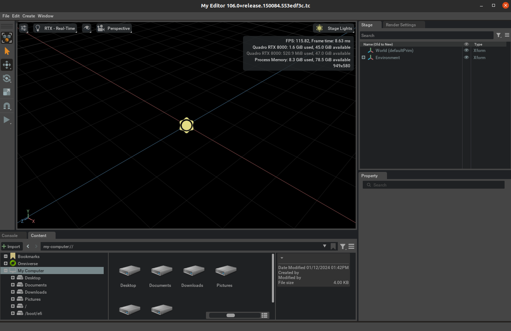

# NeofactoryNotes
Example of valid asset location for rest api:
/home/keith/Documents/scratch


# Omniverse Kit App Template

<p align="center">
  
</p>

## :memo: Feature Branch Information
**This repository is based on a Feature Branch of the Omniverse Kit SDK.** Feature Branches are regularly updated and best suited for testing and prototyping.
For stable, production-oriented development, please use the [Production Branch of the Kit SDK on NVIDIA GPU Cloud (NGC)](https://catalog.ngc.nvidia.com/orgs/nvidia/teams/omniverse/collections/production_branch_december_2024).

[Omniverse Release Information](https://docs.omniverse.nvidia.com/dev-overview/latest/omniverse-releases.html#)


## Overview

Welcome to `kit-app-template`, a toolkit designed for developers interested in GPU-accelerated application development within the NVIDIA Omniverse ecosystem. This repository offers streamlined tools and templates to simplify creating high-performance, OpenUSD-based desktop or cloud streaming applications using the Omniverse Kit SDK.

### About Omniverse Kit SDK

The Omniverse Kit SDK enables developers to build immersive 3D applications. Key features include:
- **Language Support:** Develop with either Python or C++, offering flexibility for various developer preferences.
- **OpenUSD Foundation:** Utilize the robust Open Universal Scene Description (OpenUSD) for creating, manipulating, and rendering rich 3D content.
- **GPU Acceleration:** Leverage GPU-accelerated capabilities for high-fidelity visualization and simulation.
- **Extensibility:** Create specialized extensions that provide dynamic user interfaces, integrate with various systems, and offer direct control over OpenUSD data, making the Omniverse Kit SDK versatile for numerous applications.

### Applications and Use Cases

The `kit-app-template` repository enables developers to create cross-platform applications (Windows and Linux) optimized for desktop use and cloud streaming. Potential use cases include designing and simulating expansive virtual environments, producing high-quality synthetic data for AI training, and building advanced tools for technical analysis and insights. Whether you're crafting engaging virtual worlds, developing comprehensive analysis tools, or creating simulations, this repository, along with the Kit SDK, provides the foundational components required to begin development.

### A Deeper Understanding

The `kit-app-template` repository is designed to abstract complexity, jumpstarting your development with pre-configured templates, tools, and essential boilerplate. For those seeking a deeper understanding of the application and extension creation process, we have provided the following resources:

#### Companion Tutorial

**[Explore the Companion Tutorial](https://docs.omniverse.nvidia.com/kit/docs/kit-app-template/latest/docs/intro.html)**: This tutorial offers detailed insights into the underlying structure and mechanisms, providing a thorough grasp of both the Kit SDK and the development process.

### New Developers

For a beginner-friendly introduction to application development using the Omniverse Kit SDK, see the NVIDIA DLI course:

#### Beginner Tutorial

**[Developing an Omniverse Kit-Based Application](https://learn.nvidia.com/courses/course-detail?course_id=course-v1:DLI+S-OV-11+V1)**: This course offers an accessible introduction to application development (account and login required).

These resources empower developers at all experience levels to fully utilize the `kit-app-template` repository and the Omniverse Kit SDK.

## Table of Contents
- [Overview](#overview)
- [Prerequisites and Environment Setup](#prerequisites-and-environment-setup)
- [Repository Structure](#repository-structure)
- [Quick Start](#quick-start)
- [Templates](#templates)
    - [Applications](#applications)
    - [Extensions](#extensions)
- [Tools](#tools)
- [License](#license)
- [Additional Resources](#additional-resources)
- [Contributing](#contributing)

## Prerequisites and Environment Setup

Ensure your system is set up with the following to work with Omniverse Applications and Extensions:

- **Operating System**: Windows 10/11 or Linux (Ubuntu 20.04/22.04 recommended)

- **GPU**: NVIDIA RTX capable GPU (Turing or newer recommended)

- **Driver**: Minimum and recommended - 537.58. Newer versions may work but are not equally validated.

- **Internet Access**: Required for downloading the Omniverse Kit SDK, extensions, and tools.

### Required Software Dependencies

- [**Git**](https://git-scm.com/downloads): For version control and repository management

- [**Git LFS**](https://git-lfs.com/): For managing large files within the repository

- **(Windows - C++ Only) Microsoft Visual Studio (2019 or 2022)**: You can install the latest version from [Visual Studio Downloads](https://visualstudio.microsoft.com/downloads/). Ensure that the **Desktop development with C++** workload is selected.  [Additional information on Windows development configuration](readme-assets/additional-docs/windows_developer_configuration.md)

- **(Windows - C++ Only) Windows SDK**: Install this alongside MSVC. You can find it as part of the Visual Studio Installer. [Additional information on Windows development configuration](readme-assets/additional-docs/windows_developer_configuration.md)

- **(Linux) build-essentials**: A package that includes `make` and other essential tools for building applications.  For Ubuntu, install with `sudo apt-get install build-essential`

### Recommended Software

- [**(Linux) Docker**](https://docs.docker.com/engine/install/ubuntu/): For containerized development and deployment. **Ensure non-root users have Docker permissions.**

- [**(Linux) NVIDIA Container Toolkit**](https://docs.nvidia.com/datacenter/cloud-native/container-toolkit/latest/install-guide.html): For GPU-accelerated containerized development and deployment. **Installation and Configuring Docker steps are required.**

- [**VSCode**](https://code.visualstudio.com/download) (or your preferred IDE): For code editing and development


## Repository Structure

| Directory Item   | Purpose                                                    |
|------------------|------------------------------------------------------------|
| .vscode          | VS Code configuration details and helper tasks             |
| readme-assets/   | Images and additional repository documentation             |
| templates/       | Template Applications and Extensions.                      |
| tools/           | Tooling settings and repository specific (local) tools     |
| .editorconfig    | [EditorConfig](https://editorconfig.org/) file.            |
| .gitattributes   | Git configuration.                                         |
| .gitignore       | Git configuration.                                         |
| LICENSE          | License for the repo.                                      |
| README.md        | Project information.                                       |
| premake5.lua     | Build configuration - such as what apps to build.          |
| repo.bat         | Windows repo tool entry point.                             |
| repo.sh          | Linux repo tool entry point.                               |
| repo.toml        | Top level configuration of repo tools.                     |
| repo_tools.toml  | Setup of local, repository specific tools                  |

## Quick Start

This section guides you through creating your first Kit SDK-based Application using the `kit-app-template` repository. For a more comprehensive explanation of functionality previewed here, reference the following [Tutorial](https://docs.omniverse.nvidia.com/kit/docs/kit-app-template/latest/docs/intro.html) for an in-depth exploration.

### 1. Clone the Repository

Begin by cloning the `kit-app-template` to your local workspace:

#### 1a. Clone

```bash
git clone https://github.com/NVIDIA-Omniverse/kit-app-template.git
```

#### 1b. Navigate to Cloned Directory

```bash
cd kit-app-template
```

### 2. Create and Configure New Application From Template

Run the following command to initiate the configuration wizard:

**Linux:**
```bash
./repo.sh template new
```

**Windows:**
```powershell
.\repo.bat template new
```

> **NOTE:** If this is your first time running the `template new` tool, you'll be prompted to accept the Omniverse Licensing Terms.

Follow the prompt instructions:
- **? Select with arrow keys what you want to create:** Application
- **? Select with arrow keys your desired template:** Kit Base Editor
- **? Enter name of application .kit file [name-spaced, lowercase, alphanumeric]:** [set application name]
- **? Enter application_display_name:** [set application display name]
- **? Enter version:**: [set application version]


### 3. Build

Build your new application with the following command:


**Linux:**
```bash
./repo.sh build
```
**Windows:**
```powershell
.\repo.bat build
 ```

A successful build will result in the following message:

```text
BUILD (RELEASE) SUCCEEDED (Took XX.XX seconds)
```

 If you experience issues related to build, please see the [Usage and Troubleshooting](readme-assets/additional-docs/usage_and_troubleshooting.md) section for additional information.


### 4. Launch

Initiate your newly created application using:

**Linux:**
```bash
./repo.sh launch
```
**Windows:**
```powershell
.\repo.bat launch
```

**? Select with arrow keys which App would you like to launch:** [Select the created editor application]




> **NOTE:** The initial startup may take 5 to 8 minutes as shaders compile for the first time. After initial shader compilation, startup time will reduce dramatically

**Launch with Developer Bundle (Alternative):** Instead of running the default launch command, developers might prefer to include the developer bundle for access to developer-specific extensions, such as the Script Editor, Extension Manager, and more.

To launch with the developer bundle, use the `--dev-bundle` or `-d` flag:

**Linux:**
```bash
./repo.sh launch -d
```

**Windows:**
```powershell
.\repo.bat launch -d
```

For more information on the extensions available in the developer bundle, see the [Developer Bundle Extensions](readme-assets/additional-docs/developer_bundle_extensions.md) document.

## Templates

`kit-app-template` features an array of configurable templates for `Extensions` and `Applications`, catering to a range of desired development starting points from minimal to feature rich.

### Applications

Begin constructing Omniverse Applications using these templates

- **[Kit Service](./templates/apps/kit_service)**: The minimal definition of an Omniverse Kit SDK based service. This template is useful for creating headless services leveraging Omniverse Kit functionality.

- **[Kit Base Editor](./templates/apps/kit_base_editor/)**: A minimal template application for loading, manipulating and rendering OpenUSD content from a graphical interface.

- **[USD Composer](./templates/apps/usd_composer)**: A template application for authoring complex OpenUSD scenes, such as configurators.

- **[USD Explorer](./templates/apps/usd_explorer)**: A template application for exploring and collaborating on large Open USD scenes.

- **[USD Viewer](./templates/apps/usd_viewer)**: A viewport-only template application that can be easily streamed and interacted with remotely, well-suited for streaming content to web pages.

### Extensions

Enhance Omniverse capabilities with extension templates:

- **[Basic Python](./templates/extensions/basic_python)**: The minimal definition of an Omniverse Python Extension.

- **[Basic C++](./templates/extensions/basic_cpp)**: The minimal definition of an Omniverse C++ Extension.

   **Note for Windows C++ Developers** : This template requires `"platform:windows-x86_64".enabled` and `link_host_toolchain` within the `repo.toml` file be set to `true`. For additional C++ configuration information [see here](readme-assets/additional-docs/windows_developer_configuration.md).

- **[Python UI](./templates/extensions/python_ui)**: An extension that provides an easily extendable Python-based user interface.

## Tools

The `kit-app-template` includes a suite of tools to aid in the development, testing, and deployment of your projects. For a more detailed overview of available tooling, see the [Kit App Template Tooling Guide](readme-assets/additional-docs/kit_app_template_tooling_guide.md).

Here's a brief overview of some key tools:

- **Help (`./repo.sh -h` or `.\repo.bat -h`):** Provides a list of available tools and their descriptions.

- **Template Creation (`./repo.sh template` or `.\repo.bat template`):** Assists in starting a new project by generating a scaffold from a template application or extension.

- **Build (`./repo.sh build` or `.\repo.bat build`):** Compiles your applications and extensions, preparing them for launch.

- **Launch (`./repo.sh launch`or`.\repo.bat launch`):** Starts your compiled application or extension.

- **Testing (`./repo.sh test` or `.\repo.bat test`):** Facilitates the execution of test suites for your extensions, ensuring code quality and functionality.

- **Packaging (`./repo.sh package` or `.\repo.bat package`):** Aids in packaging your application for distribution, making it easier to share or deploy in cloud environments.


## License

Development using the Omniverse Kit SDK is subject to the licensing terms detailed [here](https://docs.omniverse.nvidia.com/dev-guide/latest/common/NVIDIA_Omniverse_License_Agreement.html).

## Data Collection
The Omniverse Kit SDK collects anonymous usage data to help improve software performance and aid in diagnostic purposes. Rest assured, no personal information such as user email, name or any other field is collected.

To learn more about what data is collected, how we use it and how you can change the data collection setting [see details page](readme-assets/additional-docs/data_collection_and_use.md).


## Additional Resources

- [Kit App Template Companion Tutorial](https://docs.omniverse.nvidia.com/kit/docs/kit-app-template/latest/docs/intro.html)

- [Usage and Troubleshooting](readme-assets/additional-docs/usage_and_troubleshooting.md)

- [Developer Bundle Extensions](readme-assets/additional-docs/developer_bundle_extensions.md)

- [Omniverse Kit SDK Manual](https://docs.omniverse.nvidia.com/kit/docs/kit-manual/latest/index.html)


## Contributing

We provide this source code as-is and are currently not accepting outside contributions.