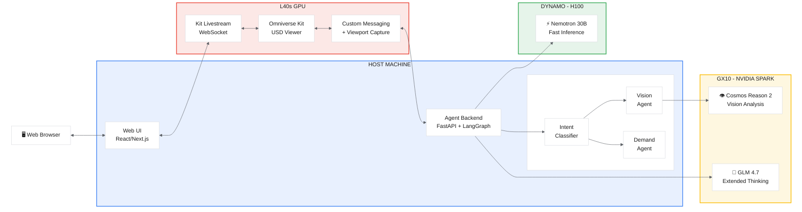
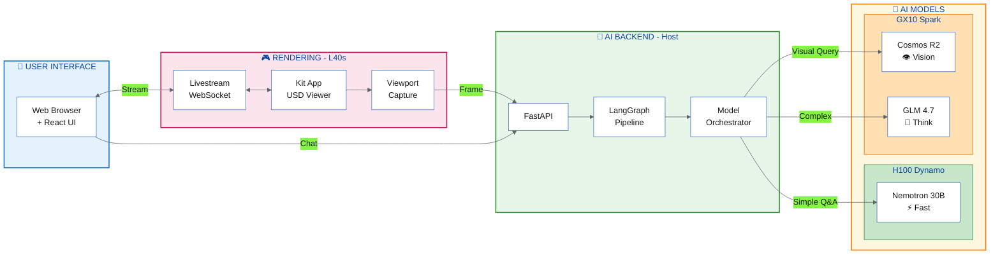
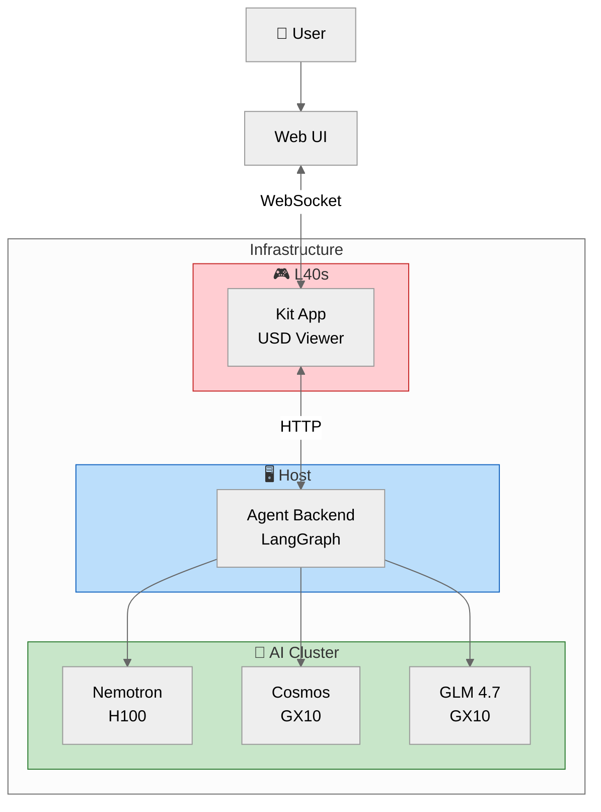
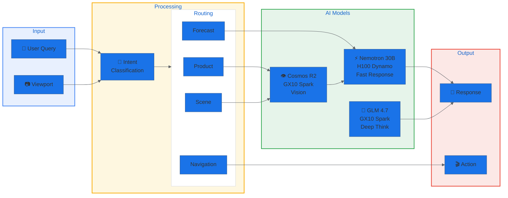

# Omniverse Retail Shop - Architecture Slide

## Single Slide Version (White Background)

---

## Horizontal Layout (Better for Wide Slides)

---

## Compact Version (Minimal)

---

## Data Flow Version

---

## Export Instructions

### Option 1: Mermaid Live Editor
1. Go to https://mermaid.live
2. Paste the diagram code
3. Click "PNG" or "SVG" to download
4. Set background to white in settings

### Option 2: VS Code
1. Install "Markdown Preview Mermaid Support" extension
2. Right-click diagram → "Export as PNG"

### Option 3: GitHub
- Push this file to GitHub, diagrams render automatically

### Recommended Slide Size
- **16:9 aspect ratio** (1920x1080)
- Use the **Horizontal Layout** for wide presentations
- Use **Compact Version** for overview slides
