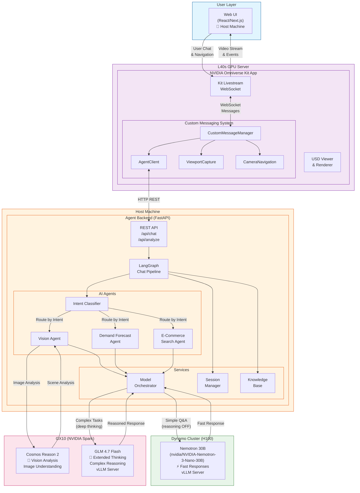
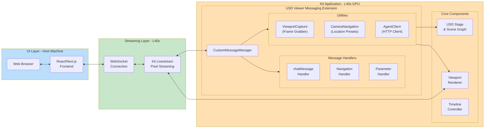
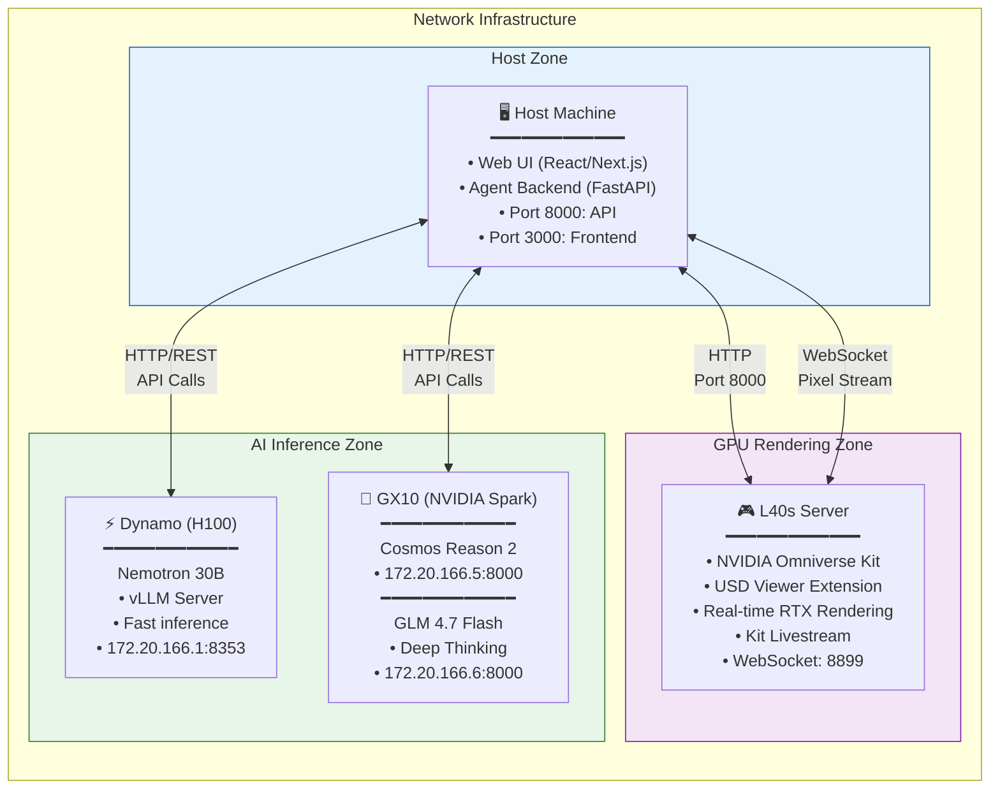
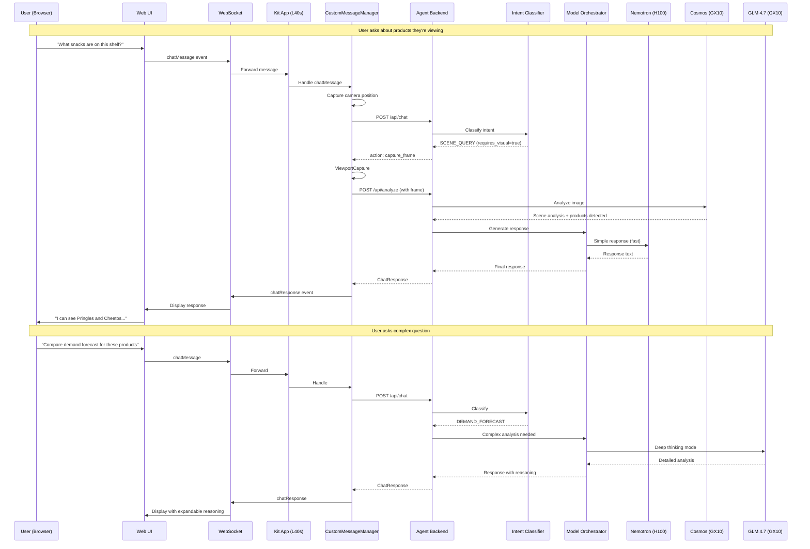
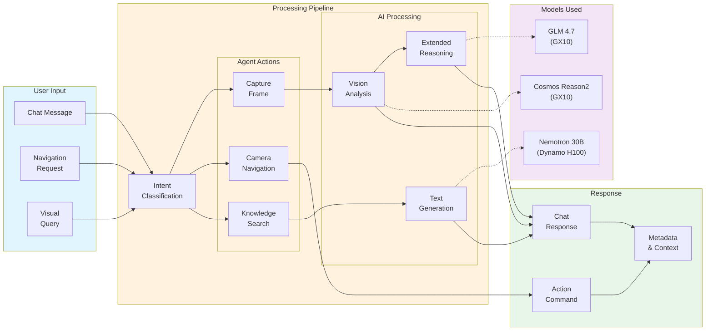

# Omniverse Retail Shop - System Architecture

## Overview
This document describes the complete system architecture for the Omniverse Retail Shop digital twin platform with AI-powered chat assistance.

---

## High-Level System Diagram



---

## Detailed Component Architecture



---

## AI Agent Pipeline (LangGraph)

```mermaid
flowchart TB
    subgraph INPUT["Input"]
        REQ["ChatRequest\n• message\n• session_id\n• frame_data\n• context"]
    end

    subgraph GRAPH["LangGraph Chat Pipeline"]
        direction TB

        CLASSIFY["classify_intent"]
        LOAD_CTX["load_context"]

        subgraph ROUTE["Intent Router"]
            GREETING["handle_greeting"]
            PRODUCT["handle_product_inquiry"]
            SCENE["handle_scene_query"]
            NAV["handle_navigation"]
            DEMAND["handle_demand_forecast"]
            EC["handle_ec_search"]
            QA["handle_general_qa"]
        end

        SAVE["save_to_history"]
    end

    subgraph MODELS["Model Selection"]
        direction LR
        NEM_FAST["Nemotron\n⚡ Fast\n(reasoning OFF)"]
        NEM_THINK["Nemotron\n💭 Thinking\n(reasoning ON)"]
        GLM_DEEP["GLM 4.7\n🧠 Deep\nThinking"]
        COSMOS_VIS["Cosmos Reason2\n👁️ Vision"]
    end

    subgraph OUTPUT["Output"]
        RESP["ChatResponse\n• message\n• action\n• action_params\n• metadata"]
    end

    REQ --> CLASSIFY
    CLASSIFY --> LOAD_CTX

    LOAD_CTX -->|"GREETING"| GREETING
    LOAD_CTX -->|"PRODUCT_INQUIRY"| PRODUCT
    LOAD_CTX -->|"SCENE_QUERY"| SCENE
    LOAD_CTX -->|"NAVIGATION"| NAV
    LOAD_CTX -->|"DEMAND_FORECAST"| DEMAND
    LOAD_CTX -->|"EC_SEARCH"| EC
    LOAD_CTX -->|"GENERAL_QA"| QA

    GREETING --> SAVE
    PRODUCT --> SAVE
    SCENE --> SAVE
    NAV --> SAVE
    DEMAND --> SAVE
    EC --> SAVE
    QA --> SAVE

    PRODUCT -->|"Visual Query"| COSMOS_VIS
    SCENE -->|"Visual Query"| COSMOS_VIS
    QA -->|"Simple"| NEM_FAST
    DEMAND -->|"Analysis"| NEM_THINK
    EC -->|"Search"| NEM_FAST

    COSMOS_VIS -->|"Enriched\nResponse"| GLM_DEEP

    SAVE --> RESP

    classDef input fill:#e3f2fd
    classDef graph fill:#fff8e1
    classDef models fill:#fce4ec
    classDef output fill:#e8f5e9

    class INPUT input
    class GRAPH,ROUTE graph
    class MODELS models
    class OUTPUT output
```

---

## Infrastructure Topology



---

## Message Flow Sequence



---

## Data Flow Summary



---

## Component Summary Table

| Component | Location | Purpose | Technology |
|-----------|----------|---------|------------|
| **Web UI** | Host Machine | User interface for chat & visualization | React/Next.js |
| **Agent Backend** | Host Machine | AI orchestration & API | FastAPI + LangGraph |
| **Kit App** | L40s GPU | USD rendering & streaming | NVIDIA Omniverse Kit |
| **Custom Messaging** | L40s GPU | Kit ↔ Backend communication | Python Extension |
| **Nemotron 30B** | Dynamo (H100) | Fast text generation | vLLM Server |
| **Cosmos Reason2** | GX10 (Spark) | Vision/image analysis | Custom API |
| **GLM 4.7 Flash** | GX10 (Spark) | Extended thinking/reasoning | vLLM Server |

---

## API Endpoints

| Endpoint | Method | Purpose |
|----------|--------|---------|
| `/api/chat` | POST | Process chat messages |
| `/api/analyze` | POST | Analyze captured frames |
| `/api/session/{id}` | GET | Get session info |
| `/api/products/search` | GET | Search product catalog |
| `/health` | GET | Health check |

---

## Intent Types & Routing

| Intent | Handler | Model Used | Action |
|--------|---------|------------|--------|
| `GREETING` | `handle_greeting` | None (static) | None |
| `PRODUCT_INQUIRY` | `handle_product_inquiry` | Nemotron/Cosmos | capture_frame |
| `SCENE_QUERY` | `handle_scene_query` | Cosmos → Nemotron | capture_frame |
| `NAVIGATION` | `handle_navigation` | None | navigate_to |
| `DEMAND_FORECAST` | `handle_demand_forecast` | Nemotron/GLM | forecast_demand |
| `EC_SEARCH` | `handle_ec_search` | Nemotron | search_ec |
| `GENERAL_QA` | `handle_general_qa` | Nemotron | None |
