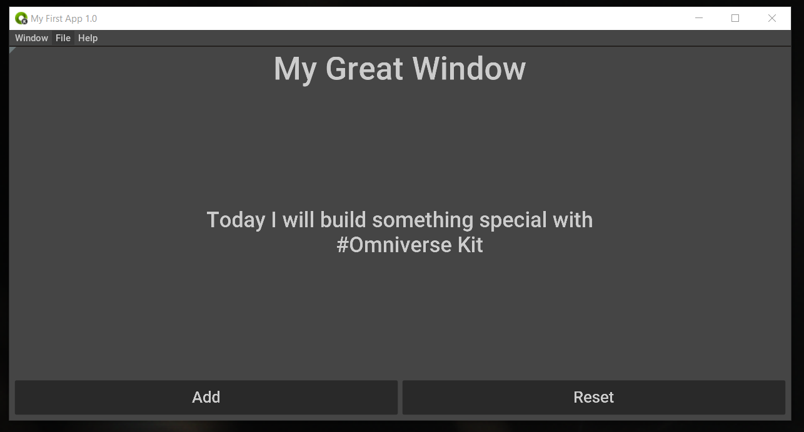
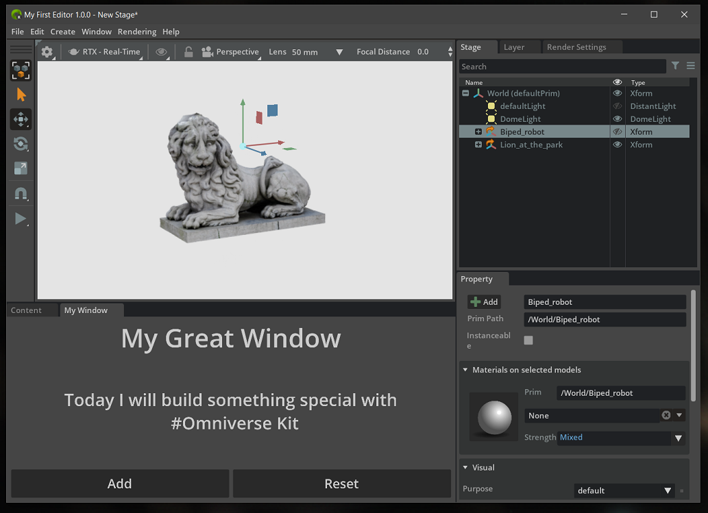
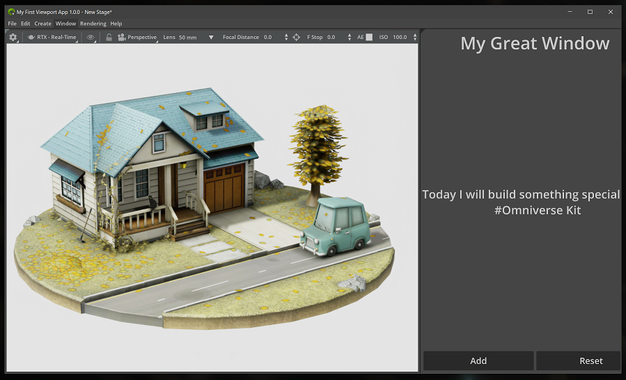

# Example Apps

## Simple App Window: `my_name.my_app.kit`

The simple application showcases how to create a very basic Kit-based application showing a simple window.

It leverages the kit compatibility mode for the UI that enables it to run on virtually any computer with a GPU.

It uses the window extension example that shows how you can create an extension that shows the window in your application.

## Editor App: `my_name.my_app.editor.kit`

The simple Editor application showcases how you can start leveraging more of the Omniverse Shared Extensions around USD editing to create an application that has the basic features of an app like Create.

It will require an RTX compatible GPU, Turing or above.

You can see how it uses the kit.QuickLayout to setup the example Window at the bottom next to the Content Browser, of course you can choose your own layout and add more functionality and Windows.

## Simple Viewport App: `my_name.my_app.viewport.kit`

This simple viewport application showcases how to create an application that leverages the RTX Renderer and the Kit Viewport to visualize USD files.

It will require an RTX compatible GPU, Turing or above.

The functionality is very limited to mostly viewing the data, and is just a starting point for something you might want to build from.

You can see how it uses the kit.QuickLayout to setup the example Window on the right of the Viewport but you can setup any layout that you need.
