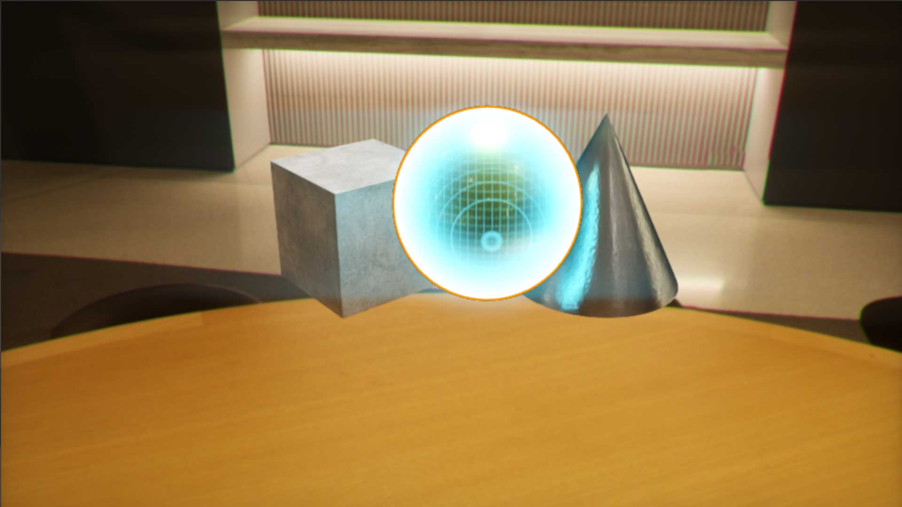
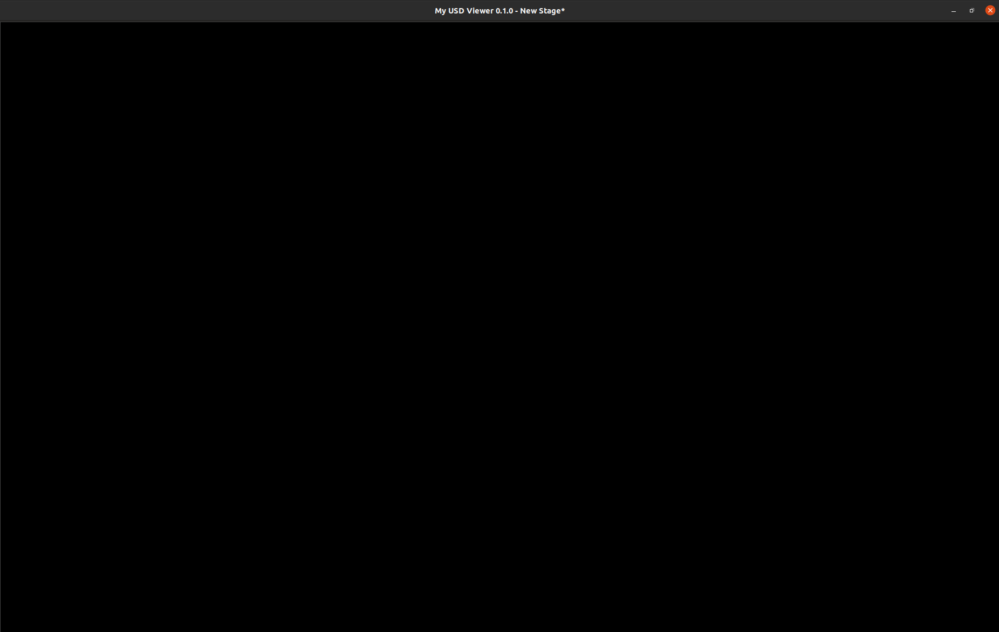
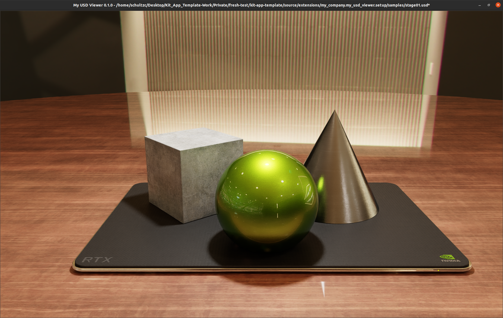
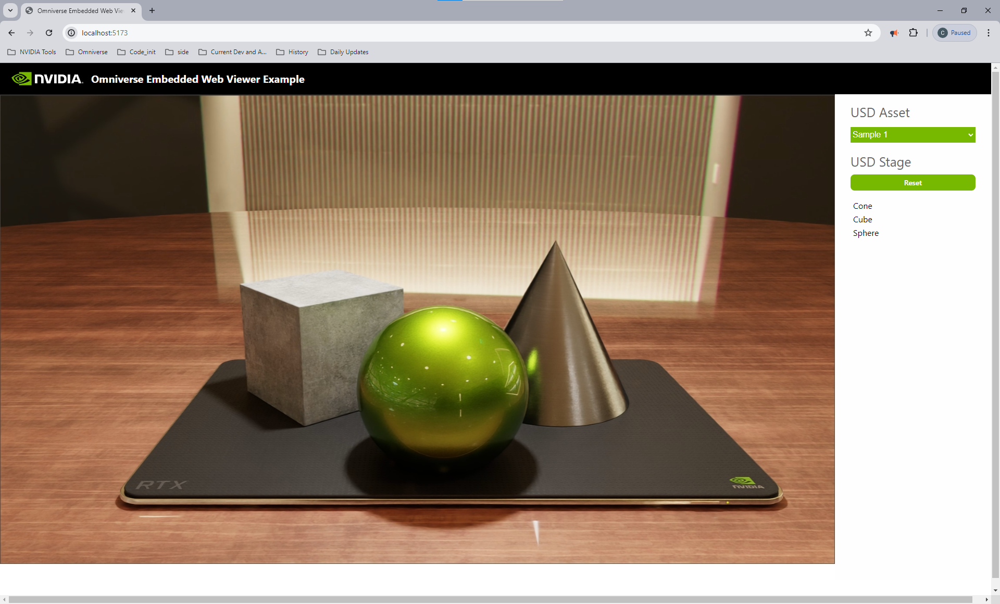

# USD Viewer App Template




## Overview

The USD Viewer App Template is designed to provide a robust starting point for developers looking to create streaming Omniverse Applications. This template showcases an RTX viewport, app streaming, and messaging support.

### Use Cases

The USD Viewer Template is perfectly suited for streaming into a front end client.

## Usage

### Getting Started

To get started with the USD Viewer template, ensure your development environment meets the prerequisites outlined in the top-level [**README**](../../../README.md#prerequisites-and-environment-setup).

> **NOTE:** Example commands should be executed in **powershell** in Windows and **terminal** in Linux.

:warning: **Important:** Before proceeding with the cloning step, ensure that Git Large File Storage (Git LFS) is installed on your system. To verify this, run the following command in your terminal:

```bash
git lfs --version
```

If the command returns a version number, Git LFS is installed correctly. If not, you will need to install Git LFS. You can download and install it from the official website [here](https://git-lfs.github.com/).

#### Cloning the Repository

```bash
git clone https://github.com/NVIDIA-Omniverse/kit-app-template.git
cd kit-app-template
```

#### Create New Application

**Note for USD Viewer** : This application requires `extra` and `setup` extensions to function as intended. These extensions handle the configuration within application, communication, layout, and other settings. During Application configuration, you will be prompted for information about these extensions.

> **NOTE:** Feel free to use default values for testing purposes.

**Linux:**
```bash
./repo.sh template new
```

**Windows:**
```powershell
.\repo.bat template new
```

> **NOTE:** If this is your first time running the `template new` tool, you'll be prompted to accept the Omniverse Licensing Terms.

Follow the prompt instructions:
- **? Select with arrow keys what you want to create:** Application
- **? Select with arrow keys your desired template:** USD Viewer
- **? Enter name of application .kit file [name-spaced, lowercase, alphanumeric]:** [set application name]
- **? Enter application_display_name:** [set application display name]
- **? Enter version:** [set app version]

*For each required extension you will be prompted
[display name] -> [extension name]:*
- **? Enter name of extension [name-spaced, lowercase, alphanumeric]:** [set extension name]
- **? Enter extension_display_name:** [set extension display name]
- **? Enter version:** [set extension version]

> **NOTE:** You will need to repeat above steps for each extension.

### Build and Launch
Note that the build step will build all applications contained in the `source` directory. Outside of initial experimentation, it is recommended that you build only the application you are actively developing.

#### Build your application using the provided build scripts:

**Linux:**
```bash
./repo.sh build
```
**Windows:**
```powershell
.\repo.bat build
```

 If you experience issues related to build, please see the [Usage and Troubleshooting](readme-assets/additional-docs/usage_and_troubleshooting.md) section for additional information.

#### Launch your application:

**Linux:**
```bash
./repo.sh launch
```
**Windows:**
```powershell
.\repo.bat launch
```

**? Select with arrow keys which App would you like to launch:** [Select the desired viewer application]

> **NOTE:** The initial startup may take a 5 to 8 minutes as shaders compile for the first time. After initial shader compilation, startup time will reduce dramatically.

#### Default Launch State
By default, the USD Viewer template application opens with an empty viewport.



This is the intended behavior. The USD Viewer template application is designed as a base for displaying content either locally or over a streaming connection (See the [Local Streaming](#local-streaming) section below).

To display content in the desktop application, you can pass an argument to the `repo launch` command to load content on startup. The USD Viewer template includes sample assets for this purpose. Let's load the `stage01.usd` sample asset by providing the full path to the `/app/auto_load_usd` argument.

**Linux:**
```bash
./repo.sh launch -- --/app/auto_load_usd={replace-with-full-path-to-kit-app-template}/_build/linux-x86_64/release/samples/stage01.usd
```

**Windows:**
```powershell
.\repo.bat launch -- --/app/auto_load_usd={replace-with-full-path-to-kit-app-template}\_build\windows-x86_64\release\samples\stage01.usd
```



### Testing
Applications and their associated extensions can be tested using the `repo test` tooling provided. Each application template includes an initial test suite that can be run to verify the application's functionality.

> **NOTE:** Testing will only be run on applications and extensions within the build directory. **A successful build is required before testing.**

**Linux:**
```bash
./repo.sh test
```

**Windows:**
```powershell
.\repo.bat test
```

#### Create Custom Extension

**Linux:**
```bash
./repo.sh template new
```

**Windows:**
```powershell
.\repo.bat template new
```

Follow the prompt instructions:
- **? Select with arrow keys what you want to create:** Extension
- **? Select with arrow keys your desired template:**: [choose extension template]
- **? Enter name of extension [name-spaced, lowercase, alphanumeric]:**: [set extension name]
- **? Enter extension_display_name:**: [set extension display name]
- **? Enter version:**: [set extension version]


#### Adding Extension to .kit File
**Importantly** For an extension to become a persistent part of an application, the extension will need to be added to the `.kit` file.

```toml
[dependencies]
"extension.name" = {}
```

#### Build with New Extensions
After a new extension has been added to the `.kit` file, the application should be rebuilt to ensure extensions are populated to the build directory.

### Packaging and Deployment

For deploying your application, create a deployable package using the `package` command:

**Linux:**
```bash
./repo.sh package
```
**Windows:**
```powershell
.\repo.bat package
```

By default, the `package` command will name the package based on the `name` value contained in the `repo.toml` file at the root of the repository. **By default, this value is set to `kit-app-template`.** Modify this value to set a persistent package name for your application.

Alternatively, you can specify a package name using the `--name` flag:

**Linux:**
```bash
./repo.sh package --name <package_name>
```
**Windows:**
```powershell
.\repo.bat package --name <package_name>
```

This will bundle your application into a distributable format, ready for deployment on compatible platforms.

:warning: **Important Note for Packaging:** Because the packaging operation will package everything within the `source/` directory the package version will need to be set independently of a given `kit` file.  **The version is set within the `tools/VERSION.md` file.**

#### Launching a Package

Applications packaged using the `package` command can be launched using the `launch` command:

**Linux:**
```bash
./repo.sh launch --package <full-path-to-package>
```
**Windows:**
```powershell
.\repo.bat launch --package <full-path-to-package>
```

> **NOTE:** This behavior is not supported when packaging with the `--thin` flag.

### Containerization (Linux Only)

**Requires:** `Docker` and `NVIDIA Container Toolkit`

The packaging tooling provided by the Kit App Template also supports containerization of applications. This is especially useful for deploying headless services and streaming applications in a containerized environment.

To package your application as a container image, use the `--container` flag:

**Linux:**
```bash
./repo.sh package --container
```

You will be prompted to select a `.kit` file to serve as the application to launch via the container entrypoint script. This will dictate the behavior of your containerized application.

For example, if you are containerizing an application for streaming, select the `{your-app-name}_streaming.kit` file to ensure the correct application configuration is launched within the container.

> **NOTE:** If creating a container for Omniverse Cloud Managed PaaS (OVC), select the `{your-app-name}_ovc.kit` file to ensure the proper settings are used for that platform.

Similar to desktop packaging, the container option allows for specifying a package name using the `--name` flag to name the container image:

**Linux:**
```bash
./repo.sh package --container --name [container_image_name]
```

#### Launching a Container

Applications packaged as container images can be launched using the `launch` command:

**Linux:**
```bash
./repo.sh launch --container
```

If only a single container image exists, it will launch automatically. If multiple container images exist, you will be prompted to select the desired container image to launch.

### Local Streaming

The UI-based template applications in this repository produce more than a single `.kit` file. For the USD Viewer template application, this includes `{your-app-name}_gdn.kit` and `{your-app-name}_streaming.kit`. For local streaming, we'll use the `{your-app-name}_streaming.kit` file. This file inherits from the base application and adds necessary streaming components like `omni.kit.livestream.webrtc`. To try local streaming, you need a web client to connect to the streaming server.

#### 1. Clone Web Viewer Sample

The web viewer sample can be found [here](https://github.com/NVIDIA-Omniverse/web-viewer-sample)

```base
git clone https://github.com/NVIDIA-Omniverse/web-viewer-sample.git
```

Follow the instructions in the README to install the necessary dependencies.

#### 2. Start the streaming Kit Application

:warning: **Important**: Launching the streaming application with `--no-window` passes an argument directly to Kit allowing it to run without the main application window to prevent conflicts with the streaming client.

**Launch and stream a desktop application:**

**Linux:**
```bash
./repo.sh launch -- --no-window
```
**Windows:**
```powershell
.\repo.bat launch -- --no-window
```

Select the `{your-app-name}_streaming.kit` and wait for the application to start

**Launch and stream a containerized application:**

When streaming a containerized application, ensure that the containerized application was configured during packaging to launch a streaming application (e.g., `{your_app_name}_streaming.kit`).

**Linux:**
```bash
./repo.sh launch --container
```

If only a single container image exists, it will launch automatically. If multiple container images exist, you will be prompted to select the desired container image to launch.

> **NOTE:** The `--no-window` flag is not required for containerized applications as it is the default launch behavior.

#### 3. Start the Streaming Client
```bash
npm run dev
```

In a Chromium-based browser, navigate to [http://localhost:5173/](http://localhost:5173/) and you should see the streaming client connect to the running Kit application.




## Additional Learning

- [Usage and Troubleshooting](readme-assets/additional-docs/usage_and_troubleshooting.md)

- [BETA - Developer Bundle Extensions](readme-assets/additional-docs/developer_bundle_extensions.md)

- [Omniverse Kit SDK Manual](https://docs.omniverse.nvidia.com/kit/docs/kit-manual/latest/index.html)
