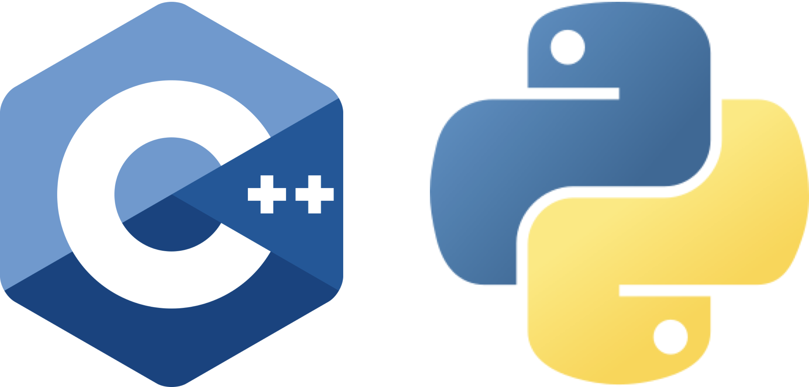

# C++ with Python Bindings Extension Template

<p align="center">
  
</p>

## Overview

The C++ with Python Bindings Extension Template is a starting point for developers who need the performance benefits of C++ while offering a Python-friendly interface through Pybind11. Designed for the NVIDIA Omniverse ecosystem, this template provides a best-practices structure to seamlessly integrate with the Omniverse Kit SDK and enable easy consumption of extension features from Python.

**Note for Windows C++ Developers**: This template requires that Visual Studio be installed on the host. Additionally, `"platform:windows-x86_64".enabled` and `link_host_toolchain` within the `repo.toml` file must be set to `true`. For more details, see the [Windows Developer Configuration guide](../../../readme-assets/additional-docs/windows_developer_configuration.md).

### Use Cases

This template is ideal for developers looking to build:

- A reusable C++ extension that can be easily integrated with Omniverse Kit SDK applications.
- Performance-sensitive extensions that leverage C++ while still exposing a Python interface.
- Extensions that require direct access to the Omniverse Kit or Carbonite SDK C++ API, with the added ability for Python scripting.
- Integrations with existing C++ libraries or codebases while offering Python-friendly APIs for broader adoption.

### Key Features

- Structure well suited for the build, test, and packaging tooling within this repository.
- All required setup code for bridging C++ logic with Python using Pybind11.
- Best practices for organizing C++ source and Python binding code into a single extension.
- Smooth integration with the Omniverse Kit SDK for application deployment.

-------------------------------------------------------------------------------

## Usage

This section details how to set up and use the C++ with Python Bindings Extension Template.

### Getting Started

Before you begin, ensure your development environment meets the prerequisites outlined in the [top-level README](../../../README.md#prerequisites-and-environment-setup).

#### Cloning the Repository

Use the following steps to clone the repository locally:

```bash
git clone https://github.com/NVIDIA-Omniverse/kit-app-template.git
cd kit-app-template
```

#### Create New Extension

Use the provided script (either shell or PowerShell) to start a new extension from the template.

**Linux:**
```bash
./repo.sh template new
```

**Windows:**
```powershell
.\repo.bat template new
```

Follow the prompts in your terminal:

- **? Select what you want to create with arrow keys ↑↓:** Extension
- **? Select desired template with arrow keys ↑↓:** Basic C++ w/ Python Binding Extension
- **? Enter name of extension [name-spaced, lowercase, alphanumeric]:** [set extension name]
- **? Enter extension_display_name:** [set extension display name]
- **? Enter version:** [set extension version]

#### Build and Launch

While C++ extensions require a build step, this template is structured so that the build, test, and packaging processes are conveniently handled through the Omniverse Kit SDK’s application tooling. Python developers can then import the resulting module for a seamless C++-backed Python experience.

Launching an extension typically requires that it be part of an Omniverse [Service](../../apps/kit_service/README.md) or [Editor](../../apps/kit_base_editor/README.md) application.

**Adding an Extension to an Application**

To add your extension to an application, declare it in the dependencies section of the application's `.kit` file:

```toml
[dependencies]
"my_company.my_extension" = {}
```

#### Build with New Extensions

After adding your new extension, re-run the build process for the application. This ensures your compiled C++ code and Python bindings are included in the final build artifacts.

### Customization

Customization of this C++/Python Binding Extension may involve:

- Extending or altering the C++ source files to incorporate new functionalities.
- Adjusting the Pybind11 binding code to expose additional methods, classes, or data structures to Python.
- Integrating other C++ or Python libraries as needed.

As with any extension, dependencies can be declared on other custom or registry-based extensions. Whether you need more specialized C++ libraries or Python packages, you can add them to your extension as desired. Note that only a limited number of registry extensions expose a C++ API, so validate your dependencies accordingly.

-------------------------------------------------------------------------------

## Additional Learning

- [Kit Manual Extension Docs](https://docs.omniverse.nvidia.com/kit/docs/kit-manual/latest/guide/extensions_basic.html)
- [C++ Extension Examples](https://github.com/NVIDIA-Omniverse/kit-extension-template-cpp)
- [Kit SDK Companion Tutorial](https://docs.omniverse.nvidia.com/kit/docs/kit-app-template/latest/docs/intro.html)
- [Pybind11 Documentation](https://pybind11.readthedocs.io/)