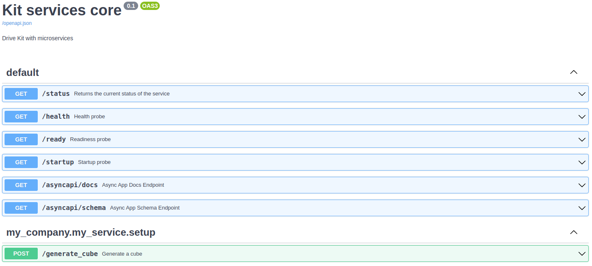

# Service Setup Extension Template

## Overview

The Service Setup Extension Template is designed to facilitate the configuration and setup of a headless service that leverages the Omniverse Kit SDK.

Though it is possible in this case, setup extensions are not typically intended to be used as a generic extension but as a specific component of a particular application.

### Use Cases

This setup extension is well suited for:

- Developers building headless services that require Kit SDK functionalities.

### Key Features

- Sample ServiceAPIRouter setup.
- Sample endpoint to demonstrate interaction patterns within service Kit SDK and OpenUSD.

## Usage

This extension is automatically created and configured when you generate a new service application using the [Service Application Template](../../apps/kit_service/README.md).

## Additional Learning
- [Omniverse Kit Service Documentation](https://docs.omniverse.nvidia.com/services/latest/index.html)
- [Kit App Template Companion Tutorial](https://docs.omniverse.nvidia.com/kit/docs/kit-app-template/latest/docs/intro.html)