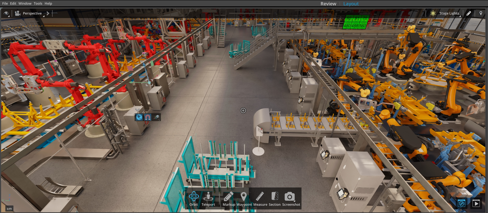

# USD Explorer Setup Extension Template

## Overview

The USD Explorer Setup Extension Template is specifically designed to configure the USD Explorer Template application. This setup extension ensures the proper integration and configuration of specific components and extensions required for the USD Explorer Template application to function as intended.

### Use Cases

This setup extension is particularly useful for:

- Customizing the setup and configuration of the USD Explorer Application Template.
- Learning more (by example) about advanced usage of the Kit SDK and Omniverse Extensions.

### Key Features

- Custom configurations tailored to the USD Explorer Template Application.

## Usage

This extension is automatically created and configured when you generate a new application based on the [USD Explorer Template Application](../../apps/usd_explorer/README.md).

This extension does provide a learning opportunity for developers to understand how applications can be extensively customized and configured using a setup extension.

## Additional Learning

- [Kit Manual - Advanced Extensions](https://docs.omniverse.nvidia.com/kit/docs/kit-manual/latest/guide/extensions_advanced.html)
- [Kit App Template Companion Tutorial](https://docs.omniverse.nvidia.com/kit/docs/kit-app-template/latest/docs/intro.html)